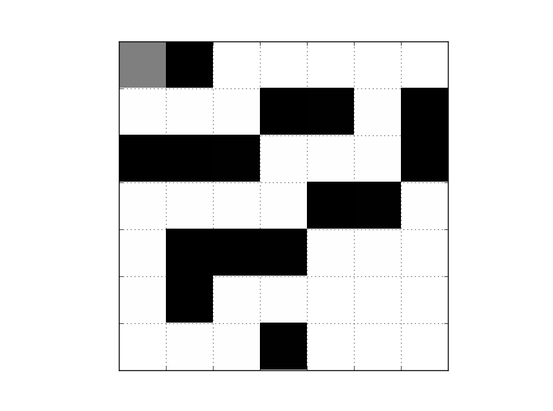

# rl-maze-pathfinding
This repository contains the implementation of a deep reinforcement learning model designed to simulate a rat navigating through a maze. The model applies the Q-learning algorithm, showcasing the rat's learning process as it seeks a reward within a randomly generated maze environment. Model is an abstraction of a rat brains basal ganglia decision making process.
[Link to the full paper](https://docs.google.com/document/d/1bf9Lfl85LOU79KzbvKR7_3M7NwdvtFNDYFOPVd2XghA/edit?usp=sharing)
<div align="center">
  
</div>
## Model Overview
The model utilizes a deep Q-learning approach, leveraging a neural network (termed as 'mouse_brain') to predict the most rewarding actions. This network is trained through interactions within a variety of mazes, where it learns to navigate from start to finish by trial and error, optimizing its path to the goal over time.
### Running the Model
To train the model, run train.py which sets up the environment, initiates the 'mouse_brain', and begins the learning process through repeated maze trials. The training loop updates the model's weights based on rewards received, refining its decision-making abilities.
```
# Generate a maze and create a Qmaze instance
maze = generate_random_maze()
qmaze = Qmaze(maze)

# Initialize and train the model
model = mouse_brain(maze)
qtrain(model, maze, epochs=500, max_memory=30, data_size=8)
```

## Training data 
For training, our model uses procedurally generated mazes represented as 2D binary arrays, with 1 and 0 indicating open paths and walls, respectively. The generation algorithm ensures all mazes are solvable, maintaining fixed start and end points to optimize the learning process. This setup provides a controlled yet varied learning environment for the deep Q-learning algorithm to develop maze navigation strategies. 


## Project Structure
The repository is structured as follows:
```
data/: Contains the raw datasets used for training and evaluation.
models/: Holds the trained models and their weights for future reference or additional training.
q-learning-train/: Source code for model implementation, training, and performance metrics.
data-generation/: Includes the Qmaze environment and Experience replay mechanism

Files
- `train.py`: Contains the training loop and logic.
- `mousebrain.py`: Defines the neural network architecture used by the mouse agent.
- `data-generation/mazedata.py`: Includes the Qmaze environment and Experience replay mechanism.
```

## Installation
To set up the project environment, follow these steps:
```
1. Clone the repository:
2. bash git clone https://github.com/your-username/qmaze-data.git
3. cd qmaze-data
4. pip install -r requirements.txt
```

## Usage
Run QMaze-Data.ipynb in a Jupyter environment to simulate the maze-solving algorithm. You can use Google Colab or any local Jupyter setup.
To visualize the performance and metrics of the learning process, refer to the visualization.py and metrics.py modules in the q-learning-train/ directory.

## Model Training
Training involves generating an unlimited number of random mazes with consistent start and end points. This decision was made to optimize the training time and resources. The model is trained to find the optimal path to the reward, which is located in the bottom right corner of the maze.

## Results
The final model achieved a 100% success rate with minimal loss. The model's policy generalizes well and finds optimal paths efficiently. The completion_check testing function confirmed that the model could consistently find the optimal path within 100 epochs.


